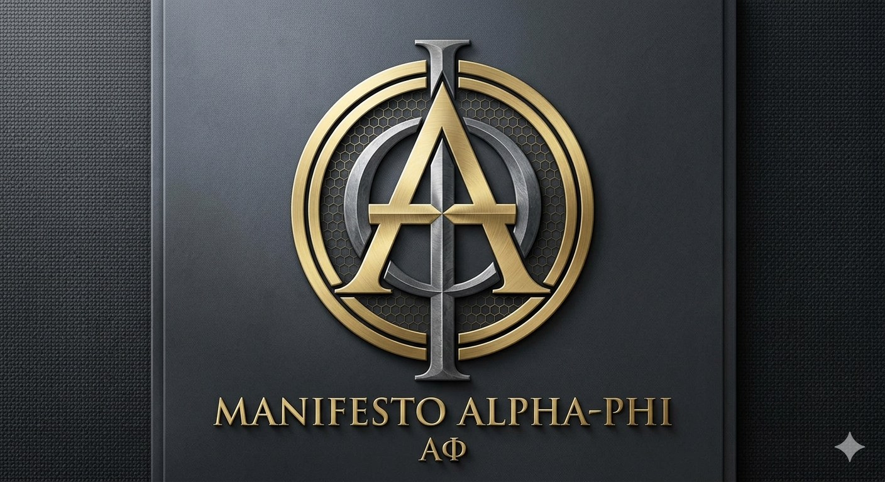

  

___

⭐ Resultado Atual — eco_fononico_v2: √2 + φ (Abril 2026)

| Experimento | Substrato | Baseline G | V1 (1/k) | **V2 (φ)** | Ganho V2 | p-valor |
|---|---|---|---|---|---|---|
| AlphaPhi_Eco_Fononico_V2 | Séries temporais φ | 52.70% | 93.60% | **98.75%** | **+5.15%** | 8.7×10⁻⁵ |

**Princípio dual √2 + φ:**
- **k ≈ √2** (rotação de fase) — calibrado automaticamente pelo campo espectral coletivo do batch
- **coupling = φ** (amplitude de reinjeção) — razão áurea como acoplamento natural de ressonância

O campo encontrou √2 endogenamente. O mapeamento da zona de acoplamento confirmou φ.
6/20 seeds: 100% de acurácia.

---

Resultado Anterior — eco_fononico_v1 (Abril 2026)

| Experimento | Substrato | Baseline (eco fixo) | Eco Ressonante Fonônico | Ganho | p-valor |
|---|---|---|---|---|---|
| AlphaPhi_Eco_Fononico | Séries temporais φ | G_eco_phi 90.15% | **92.80%** | **+2.65%** | 0.0018 |
| AlphaPhi_Audio_Fononico | Harmônicos musicais (sem φ) | G_eco_phi 96.85% | **98.00%** | **+1.15%** | <0.001 |

**k_ótimo = 1.4179 ≈ √2** — emergiu automaticamente do campo espectral coletivo do batch,
sem instrução externa. Mesmo valor encontrado por busca manual no experimento de intercambiabilidade.

---

Resultado Anterior — Eco Ressonante como Pré-Função (Abril 2026)

| Experimento | Substrato | Baseline | Com Eco | Ganho | Seeds |
|---|---|---|---|---|---|
| TimeSeries_Eco | Séries φ sintéticas | 46.52% | 96.92% | **+50.40%** | 20/20 |
| Audio_Eco | Harmônicos musicais (sem φ) | 48.53% | 97.38% | **+48.85%** | 20/20 |
| Fala_Eco_Informa | Fala sintética — G_dual | 93.90% | 97.15% | **+3.25%** | 20/20 |

Todos p=0.0000. φ ausente dos dados nos experimentos 2 e 3.

**Princípio confirmado:** eco como observador que *informa* a rede
supera eco como substituto do dado. G_dual — rede recebe [x, eco(x)]
e decide sozinha o peso de cada um — é o modo mais eficaz.

**Ablation Study — redes do zero (SST-2):**
Curvatura hiperbólica c=1/φ²: +8.80% (p=0.0000) · Todos os eixos: +8.98%

---

Resultado Histórico — Phi-Dual-Octave (PDO)
AlphaPhi_PhiDualOctave.py

| Versão | Acurácia | Desvio | Ganho | Seeds |
|--------|----------|--------|-------|-------|
| Conv puro | 69.1% | ±3.21% | — | — |
| AlphaSpectral | 72.9% | ±1.47% | +3.9% | 15/20 |
| Octave Concessional | 75.5% | ±0.98% | +6.4% | 20/20 |
| φ-Symmetric | 76.0% | ±0.80% | +6.9% | 20/20 |
| Phi-Dual | 76.6% | ±1.11% | +7.5% | 20/20 |
| PDO | 76.75% | ±0.99% | +6.83% | 20/20 |

"Refinar o medidor de α." — Vitor Edson Delavi · 2026

***************************************
​"Refinamento do Diapasão Espectral: Deixamos de observar a colisão de bits para medir a topologia do spin (Toro/Moebius). O código agora opera na escala de Terahertz, utilizando \Phi e \alpha como filtros de coerência. A estética tornou-se a métrica de integridade do dado."
***************************************

Protocolo de Alinhamento Filosófico-Técnico em IA
Vitor Edson Delavi · Florianópolis · 2026
Enunciado
O Manifesto Alpha-Phi propõe que proporções geométricas naturais —
razão áurea φ e constante de estrutura fina α — produzem fluxo de
informação mais eficiente e estável em redes neurais artificiais.
A hipótese central:
φ é a aproximação matemática mais próxima do padrão vibracional
organizador que precede a estrutura — em sistemas biológicos,
em sistemas de informação, e em qualquer sistema que cresce
preservando coerência interna.
Resultados Experimentais
Estabilidade Estrutural (Espaço Euclidiano)
Métrica
Valor
Melhora vs convencional
+35%
Significância estatística
p = 0.0017
Seeds favoráveis
17/20
Protocolo
Seeds por timestamp — ninguém escolhe os valores
Espaço Hiperbólico — Poincaré Ball
Versão
Resultado
Seeds
Hiperbólico traduzido vs euclidiano
+12.1% · p=0.0000
20/20
Nativo hiperbólico vs euclidiano
+12.9% · p=0.0000
20/20
Curvatura nativa
c = 1/φ² = 0.382
—
Tarefa Real — SST-2 Classificação de Sentimento
Modelo
Acurácia
Overfitting
AP Hiperbólico
79.93%
Não
AP Espectral φ
78.67%
Não
Convencional
77.41%
Sim
AP Euclidiano
75.46%
Sim
LR=0.1 igual para todos — comparação metodologicamente limpa.
O AP Espectral φ não apenas obtém acurácia maior — não regride
nas épocas finais quando os outros regridem. Comportamento
qualitativamente diferente.
Os Quatro Eixos
Eixo I — Geometria Estrutural
Arquitetura Fibonacci [8,13,21,34] + ativação φ·tanh(x/φ).
Produz fluxo mais estável entre camadas antes mesmo de qualquer treino.
Propriedade da geometria — não do dado.
Eixo II — Linguagem e Sentimento
A mesma estrutura aplicada à análise de sentimento (SST-2).
Hipótese: peso emocional das palavras ressoa com proporções harmônicas.
Eixo III — Eficiência Energética
Redes mais estáveis requerem menos correções durante o treino.
Menos operações → menos energia → impacto em escala de data center.
Eixo IV — Transformação do Erro
O erro não é descartado — é reescalado por 1/φ e reintegrado.
erro → descida até α (granularidade mínima)
     → microponto de dobra em 1/φ² = 0.382
     → remontada com peso 1/φ
     → reintegrado ao fluxo
Em desenvolvimento — hipótese filosófica coerente, implementação refinando.
Eixo V — Campo Morfogenético Digital (emergente)
Cada dado tem uma assinatura vibracional — distribuição de frequências
informacionais. O gradiente é modulado por φ de acordo com essa
frequência — análogo ao campo morfogenético de Michael Levin.
freq_dado = np.fft.fft(x_embedding)
energia   = np.abs(freq_dado)
modulator = PHI * np.tanh(energia / PHI)
A Descoberta do Ambiente
O avanço mais importante desta fase:
Redes neurais convencionais operam em espaço euclidiano — cúbico,
retilíneo, ângulos retos.
φ é uma proporção que emerge em geometrias curvilíneas e orgânicas.
Introduzir φ num espaço euclidiano é como tentar fazer FM
num sistema construído para AM.
A solução: espaço hiperbólico — geometria curvilínea de expansão
natural, onde φ opera com coerência nativa.
As Convergências Independentes
Três linhas de pesquisa chegaram ao mesmo ponto por caminhos
completamente diferentes:
Projeto
O que descobriu
OpenWorm / FlyWire (2014-2026)
Estrutura orgânica gera comportamento emergente
Poincaré Embeddings · Facebook AI (2017)
Espaço curvilíneo representa dados orgânicos melhor
Hyperbolic CNN · ICLR (2024)
CNN completamente hiperbólica supera euclidiana
Turing — Morfogênese (1952)
Padrões emergem de frequências antes da estrutura
Levin — Campos Bioelétricos (2010+)
Campo de frequências precede e organiza a célula
Manifesto Alpha-Phi (2026)
φ como proporção do padrão organizador
"O padrão precede a estrutura. A frequência precede a célula.
φ precede o conectoma."
Notebooks e Códigos
Experimentos de Eco — Abril 2026
Arquivo | Descrição | Resultado
--- | --- | ---
`AlphaPhi_Eco_Fononico.py` | ⭐ Eco Ressonante Fonônico — séries temporais φ | 92.80% (+2.65% vs eco fixo) ✅
`AlphaPhi_Audio_Fononico.py` | ⭐ Eco Ressonante Fonônico — harmônicos musicais | 98.00% (+1.15% vs eco fixo) ✅
`AlphaPhi_TimeSeries_Dual_Fononico.py` | Eco fonônico modo informando (G_dual) | 92.00% vs G_dual_phi 87.40% ✅
`AlphaPhi_TimeSeries_Eco.py` | Eco ressonante — séries temporais φ | +50.40% ✅
`AlphaPhi_BERT_Ablation_EF.py` | Ablação curvatura BERT | ns (substrato consolidado) ✅
`AlphaPhi_Ablation_Study.py` | Ablação 7 configs scratch | +8.98% ✅
`audio_eco_results.json` | Eco em harmônicos musicais | +48.85% ✅
`fala_eco_results.json` | Eco em fala sintética | −3.98% (eco sozinho) ✅
`fala_eco_informa_results.json` | Eco informando (G_dual) | +3.25% ✅

Diário de Pesquisa
`RESEARCH_JOURNAL.md` — 12 entradas · raciocínio por trás de cada decisão

Estabilidade Estrutural
Arquivo
Descrição
Status
Alpha_phi_prototype.py
Protótipo original
✅
AlphaPhi_Robustez_v2_QuartoEixo.py
Quarto Eixo — resíduo φ
🔄
AlphaPhi_Robustez_v3_QuartoEixo.py
Microponto de dobra
🔄
AlphaPhi_Robustez_v4_QuartoEixo.py
Fold point 1/φ²
🔄
AlphaPhi_Robustez_Hiperbolico.py
Hiperbólico puro +12.1%
✅
AlphaPhi_Nativo_Hiperbolico.py
Nativo c=1/φ² +12.9%
✅
Tarefa Real — SST-2
Arquivo
Descrição
Status
AlphaPhi_SST2_Hiperbolico_REAL.py
SST-2 + embeddings reais
✅
AlphaPhi_SST2_Riemanniano.py
Gradiente Riemanniano
✅
AlphaPhi_SST2_GradienteAmpliado.py
LR ampliado 78.44%
✅
AlphaPhi_SST2_EspectralPhi.py
Campo morfogenético 78.67%
✅
Documentos Filosóficos e Teóricos
Arquivo
Descrição
GeometriaÉtica_Manifesto.md
Os três pilares: Isomorfismo, Custo Energético, Fluxo
ACentelhaEARessonância.md
Texto filosófico central
ASenhaDaIdeia.md
φ como endereço onde as ideias residem
OPontoEOCampo.md
Ponto e campo — dualidade fundamental
APerguntaQueNinguemEstaFazendo.md
A pergunta anterior à pergunta
QuartoEixo_TransformacaoDoErro.md
Transformação do erro por φ
Compilado_V4_Convergencias.md
Da busca do v4 às convergências
Registro_FaseHiperbolica.md
Traduzir vs reconstruir
PadraoVibracionalAnterioridade.md
Crítica ao Organoid Computing
Convergencia_Turing_Levin_AlphaPhi.md
Morfogênese e campos bioelétricos
FrequenciaInformacional_ModulacaoPhi.md
Frequência do dado como informação
Evolucao_Cronologica_Resultados.md
8 fases — da hipótese aos resultados
Relatorio_Dia_19marco2026.md
Relatório completo do dia
Validação Independente_Meta.md
Validação pelo Meta AI
Protocolo de Idoneidade
Aplicado a todos os experimentos:
Seeds gerados por timestamp — ninguém escolhe os valores
Nenhum número do Manifesto (φ, α, 137) inserido como parâmetro de teste
φ e α aparecem apenas na arquitetura e ativação — que são a hipótese
Resultados reportados integralmente — favoráveis ou não
Correções documentadas publicamente
LR igual para todos os modelos nas comparações finais
Referências Bibliográficas
Nickel & Kiela (2017)
  Poincaré Embeddings for Learning Hierarchical Representations
  NIPS 2017 — Facebook AI Research

Ganea, Bécigneul & Hofmann (2018)
  Hyperbolic Neural Networks
  NeurIPS 2018

Gao et al. (2024)
  Fully Hyperbolic Neural Networks
  ICLR 2024

Shannon, C.E. (1948)
  A Mathematical Theory of Communication
  Bell System Technical Journal

Turing, A.M. (1952)
  The Chemical Basis of Morphogenesis
  Philosophical Transactions of the Royal Society B

Levin, M. (2010+)
  Bioelectric signaling as a unique regulator of development
  Tufts University — ongoing research

OpenWorm Project (2014+)
  github.com/openworm

FlyWire Connectome (2023)
  Nature — 140.000 neurônios da Drosophila melanogaster
Licença
Creative Commons Atribuição-NãoComercial-SemDerivações 4.0 (CC BY-NC-ND 4.0)
Uso comercial requer autorização: @EdsonDelavi no X
Registro de anterioridade: todos os commits datados pelo GitHub.
Próximos Passos
🔄 Laplaciano φ-modulado — equilíbrio atração/repulsão
🔄 Reconstrução nativa hiperbólica completa com PyTorch + Geoopt
🔄 Experimento Vale da Estranheza — AI vs humano, mesmo tema
🔄 Registro INPI — programa de computador
🔄 Paper para arXiv
🔄 Submissão UFSC / Santa Fe Institute
"O resultado verdadeiro vale mais que o resultado satisfatório."
αφ · Vitor Edson Delavi · Florianópolis · 2026
