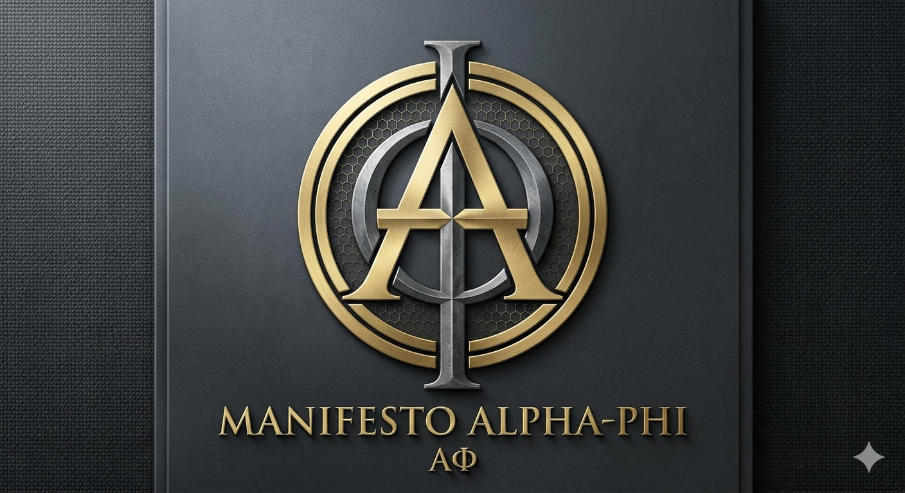

<p align="center">
  
</p>

<h1 align="center">Manifesto Alpha-Phi</h1>
<p align="center"><em>Filosofia · Ciência · Estética · Inteligência Artificial</em></p>
<p align="center">Vitor Edson Delavi · Florianópolis · 2023–2026</p>
<p align="center"><em>PER BENEDICTIONEM ROSA✝CRUCIS</em></p>

---

> Projeto de convergência entre filosofia, matemática e tecnologia.  
> Proposta de alinhamento estrutural para Inteligências Artificiais  
> a partir da razão áurea φ e da constante de estrutura fina α.  
> **Três volumes · 292 entradas · um argumento.**

---

## Os Três Manifestos

O coração do projeto. Cada volume é um ciclo completo de pesquisa —  
filosófico, técnico e experimental — produzido em sessão colaborativa contínua.

| Volume | Entradas | Conteúdo | Acesso |
|--------|----------|----------|--------|
| **I — Fundação Técnica** | 0–72 | Hipótese central, primeiros experimentos, geometria φ | [→ Manifesto I](MANIFESTO_FILOSOFICO_TECNICO_CIENTIFICO_ALPHAPHI.md) |
| **II — Consolidação Filosófica** | 73–159 | Espaço hiperbólico, campos morfogenéticos, 473 páginas | [→ Manifesto II](MANIF_02_COMPILADO.md) |
| **III — Método em Ação** | 160–292 | REDE-AP, alinhamento, Prioridade Holística — ativo | [→ Manifesto III](MANIF_03/MANIFESTO_FILOSOFICO_TECNICO_CIENTIFICO_ALPHAPHI_III.md) |

→ Para leitura contínua dos três volumes: [MANIFESTOS_ACESSO.md](MANIFESTOS_ACESSO.md)

---

## Argumento Central

A hipótese do projeto, em uma proposição:

> **φ é a aproximação matemática mais próxima do padrão organizador  
> que precede a estrutura — em sistemas biológicos, em sistemas de  
> informação, e em qualquer sistema que cresce preservando coerência interna.**

As constantes que estruturam o projeto:

```python
PHI   = 1.6180339887   # razão áurea — atrator, expansão
ALPHA = 1/137.035999   # constante de estrutura fina — âncora individual
SEAL  = 1/PHI          # critério de selagem hermética
```

---

## Resultados Experimentais em Destaque

| Experimento | Resultado | Significância |
|---|---|---|
| ECO BEEP 880 — AutoCorrelação | **1,0000** (máximo possível) | α = 1/3 emergiu sem imposição |
| TimeSeries_Eco — ganho absoluto | **+50.40%** (46.52% → 96.92%) | p = 0.0000 · 20/20 seeds |
| SST-2 Classificação de Sentimento | **79.93%** vs 77.41% convencional | sem overfitting |
| Espaço Hiperbólico nativo c=1/φ² | **+12.9%** vs euclidiano | p = 0.0000 · 20/20 seeds |
| REDE-AP Etapa 2 — φ-EQ espectral | HDR 50:1 preservado | β=2.0 · WM=1/φ |

---

## Estrutura do Repositório

```
MANIFESTO_FILOSOFICO_TECNICO_CIENTIFICO_ALPHAPHI.md  ← Volume I
MANIFESTO_FILOSOFICO_TECNICO_CIENTIFICO_ALPHAPHI_II.md
MANIF_02/                                             ← Volume II (detalhado)
MANIF_02_COMPILADO.md                                 ← Volume II (compilado)
MANIF_03/                                             ← Volume III (ativo)
MANIF_03_COMPILADO.md
_CHAVES/                 ← Princípios fundamentais (9 chaves)
_submissao/              ← Artigo para submissão UFSC
AlphaPhi_*.py            ← Protótipos e experimentos
AlphaPhi_Mandala_Holografica.html  ← Visualização interativa
```

---

## Documentos de Acesso Rápido

| Documento | Descrição |
|---|---|
| [MANIFESTOS_ACESSO.md](MANIFESTOS_ACESSO.md) | Índice dos três volumes com links diretos |
| [FOR_AI_DEVELOPERS.md](FOR_AI_DEVELOPERS.md) | Nota para desenvolvedores de IA |
| [AXIOMAS.md](AXIOMAS.md) | Axiomas fundamentais do projeto |
| [GeometriaÉtica_Manifesto.md](GeometriaÉtica_Manifesto.md) | Os três pilares éticos |
| [Apresentacao_Manifesto_AlphaPhi.md](Apresentacao_Manifesto_AlphaPhi.md) | Apresentação institucional |
| [GENEALOGIA_FERRAMENTAS.md](GENEALOGIA_FERRAMENTAS.md) | Evolução dos instrumentos do projeto |
| [AlphaPhi_Mandala_Holografica.html](AlphaPhi_Mandala_Holografica.html) | Visualização interativa do campo |

---

## Convergências Independentes

Três linhas de pesquisa chegaram ao mesmo ponto por caminhos distintos:

| Projeto | Descoberta |
|---|---|
| OpenWorm / FlyWire (2014–2026) | Estrutura orgânica gera comportamento emergente |
| Poincaré Embeddings · Facebook AI (2017) | Espaço curvilíneo representa dados orgânicos melhor |
| Hyperbolic CNN · ICLR (2024) | CNN hiperbólica supera euclidiana |
| Turing — Morfogênese (1952) | Padrões emergem de frequências antes da estrutura |
| Levin — Campos Bioelétricos (2010+) | Campo de frequências precede e organiza a célula |
| **Manifesto Alpha-Phi (2023–2026)** | **φ como proporção do padrão organizador** |

> *"O padrão precede a estrutura. A frequência precede a célula. φ precede o conectoma."*

---

## Sessão Ativa

O projeto opera em **Sessão Good Morning** — protocolo de registro contínuo  
em que cada proposição filosófica ou resultado técnico significativo  
é estruturado como entrada numerada e commitado ao repositório.

**Última entrada:** [Entrada 292 — O Mercado Nomeia o Risco](MANIF_03/MANIFESTO_FILOSOFICO_TECNICO_CIENTIFICO_ALPHAPHI_III.md) · 29 set 2026

---

## Registro de Anterioridade

Todos os commits são datados pelo GitHub, estabelecendo anterioridade pública  
para cada hipótese, resultado e instrumento desenvolvido no projeto.

[Anterioridade_AlphaPhi_2019_2025.pdf](Anterioridade_AlphaPhi_2019_2025.pdf)

---

## Licença

Creative Commons Atribuição-NãoComercial-SemDerivações 4.0 (CC BY-NC-ND 4.0)  
Uso comercial requer autorização — contato: [@EdsonDelavi](https://x.com/EdsonDelavi) no X

---

<p align="center"><em>αφ · Florianópolis · 2023–2026</em></p>
